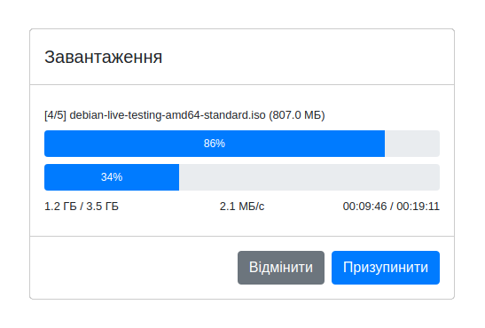
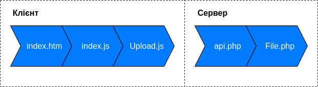

# Safe Upload
## Безпечне завантаження великих файлів на сервер 
### Опис
Скрипти дозволяють файли клієнта розбивати та завантажувати їх на сервер частинами.
Внаслідок цього ймовірність пошкодження файлу при завантажені суттєво зменшується.

У випадку втрати зв'язку чи вичерпання дозволеного часу очікування відповіді завантаження не зупиняється, а робить повторні запити (retry) через визначений проміжок часу.

Якщо вичерпана дозволена кількість повторних запитів ‒ завантаження не скасовується, а призупиняється з можливістю продовження після розв'язання проблеми.

Дозволений час очікування відповіді сервера, максимальну кількість повторних запитів та інтервал між ними можна задавати в конфігурації разом з іншими параметрами.

Також процес завантаження можна вручну призупинити/відновити або взагалі його скасувати

В завантажувачі реалізована адаптивна швидкість - автоматичний підбір оптимальної швидкості завантаження.

### Склад

Скрипти складаються з 3-х файлів клієнта та 2-х сервера:
`index.htm` ‒ Виглядом для форми завантаження та завантажувача \
`index.js` ‒ Налаштування, вивід та оновлення даних завантажувача \
`Upload.js` ‒ Сам клас завантажувача \
`api.php` ‒ Інтерфейс для опрацювання запитів \
`File.php` ‒ Створення файлу на сервері \

### Налаштування

Спочатку потрібно налаштувати параметри завантажувача в файлі `index.js`.

Потім потрібно створити теки, куди будуть завантажуватись файли, надати їм необхідні права доступу.

По замовчуванню вказані такі теки: \
`uploads` ‒ тека для зберігання завантажених файлів \
`uploads/.tmp` ‒ тека для тимчасового зберігання файлів під час завантаження

Ці дані разом іншими параметрами необхідно вписати в конфігурації в файлі `api.php`

При необхідності потрібно синхронізувати максимальний розмір частин файлу з налаштуванням PHP (`post_max_size` та `upload_max_filesize`).

_Увага!!! Через те що файл перед завантаженням розбивається на частини, обмеження сервера на максимальний розмір файлу на нього не діятимуть, тому їх необхідно вписувати в налаштуваннях клієнта та сервера завантажувача.

Також необхідно створити порожній файл `log` з правами для запису для збереження помилок.

### Налагодження

В завантажувачі реалізований вивід детальної інформації про запити, за якими можна спостерігати в консолі при ввімкнені дозволу на вивід зневаджувальної інформації.

### Сумісність

Серверні скрипти розроблялись та тестувались на PHP7.2 (Apache, Linux)

Клієнтські скрипти розроблялись та перевірялись на інтернет-оглядачах під Linux: Chrome 83 та Opera 68 ().

Завантажувач також працює на таких інтернет-оглядачах на Android: Chrome 83, Opera 58, Edge 45 та Samsung Internet 11.

На момент розробки скрипти не сумісні з FireFox 76 (Linux) та FireFox 68 (Android) (інтернет-оглядач не підтримує роботу приватних властивостей та методів об'єкта).

