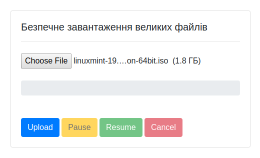

# Upload
## Безпечне завантаження великих файлів на сервер 
 

Скрипти дозволяють файли клієнта розбивати на частини та завантажувати їх на сервер.
У випадку втрати зв'язку завантаженя не зупиняється а чекає відновлення зв'язку.

Також можна вручну призупинити/відновити процес завантаження або взагалі його скасувати.

Для роботи скрипта потрібно створити теки, надати їм необхідні права доступу та вписати в файлі `api.php`.

По замовчуванню вказані такі теки: \
`uploads` ‒ тека для зберігання завантажених файлів \
`uploads/.tmp` ‒ тека для тимчасового зберігання файлів під час завантаження

