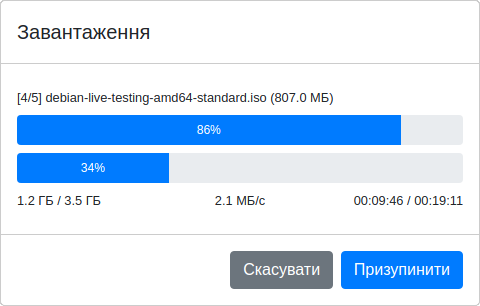

# Safe Upload
## Безпечне завантаження великих файлів на сервер 
### Опис
Скрипти дозволяють файли клієнта завантажувати на сервер не одним шматком, як зазвичай, а частинами (`chunks`).
За рахунок цього та іншого додаткового функціоналу ймовірність пошкодження файлу при завантажені суттєво зменшується.

Процес завантаження можна вручну призупинити, відновити або взагалі скасувати.

У випадку втрати зв'язку чи перевищення дозволеної тривалості очікування відповіді сервера ‒ завантаження не скасовується, а автоматично здійснює повторні запити через визначений проміжок часу.
Якщо перевищена дозволена кількість повторних запитів ‒ завантаження не скасовується, а призупиняється з можливістю продовження завантаження пізніше.

Дозволений час очікування відповіді сервера (`timeout`), максимальну кількість повторних запитів (`retry`), інтервал між ними (`interval`) разом з деякими іншими параметрами можна задавати в налаштуваннях завантажувача на стороні клієнта або сервера.

Також в завантажувачі реалізовано алгоритм адаптивної швидкості ‒ автоматичний підбір оптимальної швидкості завантаження.

### Склад

Скрипти складаються з 3-х файлів клієнта та 2-х сервера: \
`index.htm` ‒ Приклад використання вигляду завантажувача \
`index.js` ‒ Приклад налаштування та інтеграції завантажувача \
`Upload.js` ‒ Розбиває файл на частини та відправляє на сервер \
`api.php` ‒ Інтерфейс для опрацювання запитів від клієнта \
`File.php` ‒ Операції для роботи з файлом на сервері

### Налаштування

Спочатку потрібно налаштувати параметри завантажувача в файлі `index.js`.

Потім потрібно створити теки, куди будуть завантажуватись файли, надати їм необхідні права доступу.
Ці дані разом іншими параметрами необхідно вписати в конфігурації в файлі `api.php`.

По замовчуванню вказані такі теки: \
`uploads` ‒ тека для зберігання завантажених файлів \
`uploads/.tmp` ‒ тека для тимчасового зберігання файлів під час завантаження

При необхідності потрібно синхронізувати максимальний розмір частин файлу в налаштуваннях завантажувача з налаштуванням PHP (`post_max_size` та `upload_max_filesize`).

_Увага!!! Через те, що файл перед завантаженням розбивається на частини, обмеження сервера на максимальний розмір файлу на нього не діятимуть, тому їх необхідно вписувати в налаштуваннях клієнта та сервера завантажувача._

Також необхідно створити порожній файл `log` з правами для запису для збереження помилок.

### Налагодження

В завантажувачі реалізований вивід детальної інформації про запити, за якими можна спостерігати в консолі при ввімкнені дозволу на вивід зневаджувальної інформації.

### Сумісність

Серверні скрипти розроблялись та тестувались на PHP7.2 (Apache, Linux)

Клієнтські скрипти розроблялись та перевірялись на інтернет-оглядачах під Linux: Chrome 83 та Opera 68.

Завантажувач також працює на таких інтернет-оглядачах для Android: Chrome 83, Opera 58, Edge 45 та Samsung Internet 11.

На момент розробки скрипти не сумісні з FireFox 76 (Linux) та FireFox 68 (Android) (інтернет-оглядач не підтримує роботу приватних властивостей та методів об'єкта).

